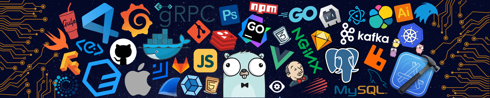

  

<h1 align="center">
  
    Hello 👋 , I'm Rudra Sanandiya !
  
</h1>

## About Me

👨‍💻 Curious about how computers work and enjoy building things from what I learn.  
I work on problem-solving and algorithms, and apply the same structured thinking to backend development.

- 🌱 **Currently Learning:** Data Structures, Algorithms & Backend Architecture  
- ⚡ **Mindset:** I care more about *why* a solution works than just making it fast  
- 💬 **Ask Me About:** C++, Algorithms, Backend Development  
- 👯 **Open To:** Meaningful open-source collaborations  

---

## Tech Stack

### Languages & Scripting

  
  
  
  
  
  

### Frontend Development

  
  
  
  
  
  
  
  

### Backend & Databases

  
  
  
  
  

### AI, ML & Data Science

  
  
  
  
  
  

### Cloud Platforms & Development Tools

  
  
  
  
  

---

## GitHub Stats
 

 

 

 

 

 

 
---

## Connect With Me

  
  
  

